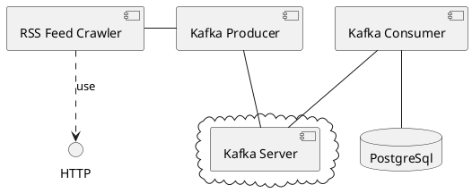

# RSS Crawler
## Idea
As the name of the project suggests, the project aims to collate articles
from a given list of rss/atom article feed. This data can be used for a
a web/mobile application.

## Design

